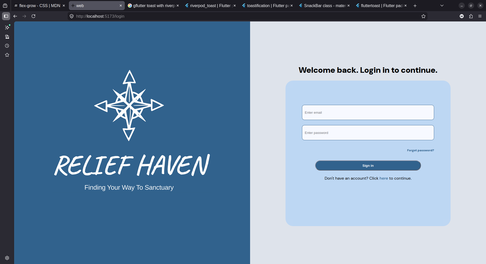
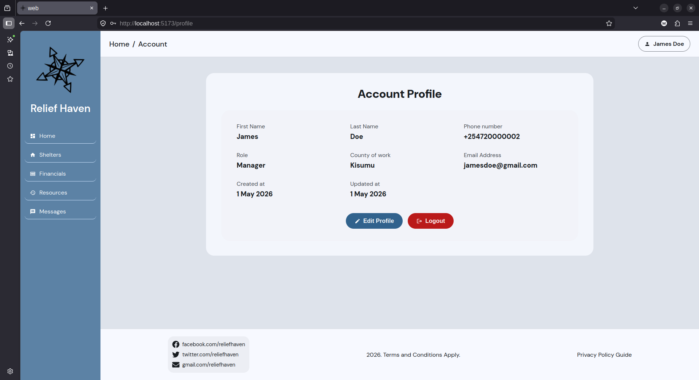

# Relief Haven


## A final year project for shelter identification and navigation during times of disasters such as floods and fires.
### [Web deployment link](https://relief-haven-git-deploy-kabz1.vercel.app/)
Logins:
- Username: johndow@gmail.com
- Password: johndoe

**(The above are just dummies 🙂🙂. Nothing to worry about😈😈)**

This project is a full-stack application built using the following technologies:

## Frontend
1. ReactJS + Vite for web
2. Flutter for mobile

## Backend
1. FastAPI for RESTful API
2. PostgreSQL for database
3. Supabase for user authentication (user IDs mapped to PostgreSQL IDs from the frontend)

## Database 
The PostgreSQL database is installed in the physical device. However, it can be accessed online upon hosting. 
The database schema consisted of 6 primary tables:
1. Users - registered users
2. Shelters - the list of shelters registered to the database
3. Resources - the resources available at each shelter
4. Chat_logs - interactions between the users(mobile) and HavenBot, a chatbot for the Relief Haven mobile application.
5. Nav_logs - logs of navigation requests made by the mobile users.
6. Donations - monetary contributions made by mobile users to the shelters.

The above tables are accessed and modified directly through the FastAPI backend using functions and procedures. Below is the ERD diagram of the database, describing the relationships between the tables.:


## Installation
Below is a guide to help you install and run the project on your local machine:

1. **Clone the repository**
   ```bash
   git clone https://github.com/Mak-Lobo/Relief-Haven.git
   ```

2. **Navigate to the backend directory**
   ```bash
   cd Relief-Haven/backend
   ```

3. **Create a virtual environment**
   ```bash
   python3 -m venv [name of virtual environment] # Linux and Mac
   python -m venv [name of virtual environment] # Windows Powershell
   ```

4. **Activate the virtual environment**
   ```bash
   source [name of virtual environment]/bin/activate # Linux and Mac
   .\venv\Scripts\activate # Windows PowerShell
   ```

5. **Install the dependencies**
   ```bash
   pip install -r requirements.txt
   ```

6. **Run the FastAPI server**
   ```bash
   fastapi dev
   ```
7. **Navigate to the frontend directory**
   ```bash
   cd Relief-Haven/frontend
   ```
8. **Install the dependencies for the web frontend**
   ```bash
   npm install
   ```
9. **Install the dependencies for the mobile frontend**
   ```bash
   flutter pub get
   ```
10. **Run the web frontend**
    ```bash
    npm run dev
    ```
11. **Run the mobile frontend in debug mode**
    ```bash
    flutter run -d [device_name] --debug
    ```

## .env Files
The project contained various credentials that stored private data and are not included in the repository for security reasons. The variables are stored in .env files in the frontend (mobile and web) and backend.

- _frontend/mobile/.env_
- _frontend/web/.env_
Backend:
- _backend/.env_


New credentials can be fetched from the following:
- Supabase
- Gemini/Antigravity
- M-Pesa Daraja platform

To use the credentials, do the following:
1. Move to the following folders:
    - _frontend/mobile/_
    - _frontend/web/_
    - _backend/_
2. Create an `.env` file by copying the `.env.example` file.
   ```bash
   cp .env.example .env
   ```
3. From Supabase, Daraja and Antigravity, fetch the credentials that correspond to the variables in the `.env` file.
4. Populate the `.env` file with the fetched credentials by replacing the placeholder texts.

## Backend URL
By default, the backend server runs on `http://127.0.0.1:8000`. The mobile device was connected wirelessly to the network. This created a problem where the mobile app could not connect to the backend server as it required the backend URL to be changed constantly based on the device IP address on the network. 

To solve this, an **NGROK** tunnel was created to provide a public URL that could be accessed by the mobile app. To run, do the following:

1. Go to the `ngrok` website and create an account.
2. Copy the authtoken provided by `ngrok` after signing in.
3. Install `ngrok` on your machine
    ```bash
    sudo snap install ngrok # Only applicable if using Ubuntu. Consult the 'ngrok' website for installation instructions for other operating systems.
    ```
4. Configure your authtoken by running the following command:
    ```bash
    ngrok authtoken [your-authtoken]
    ```
5. Start the tunnel by running the following command:
    ```bash
    ngrok http --domain=<your-static-domain>.ngrok-free.app 8000
    ```
6. Copy the public URL provided by `ngrok` and paste it in the mobile `.env` as the variable `BACKEND_URL`.
    ```env
    BACKEND_URL=ngrok public url
    ```

## Images
Below are some screenshots of the application:

### 1. Web 







### 2. Mobile

| Home light theme | Home dark theme |
|---|---|
| |  | 

| Chat | Donation | Navigation | App Drawer |
|---|---|---|---|
 |  |  |  |

| Login | Registration |
|---|---|
 |  |
<!-- [Web Signup](/images/Web signup.png)
[Web Home](/images/Web home.png)
[Web Search](/images/Web search.png)>
 -->
